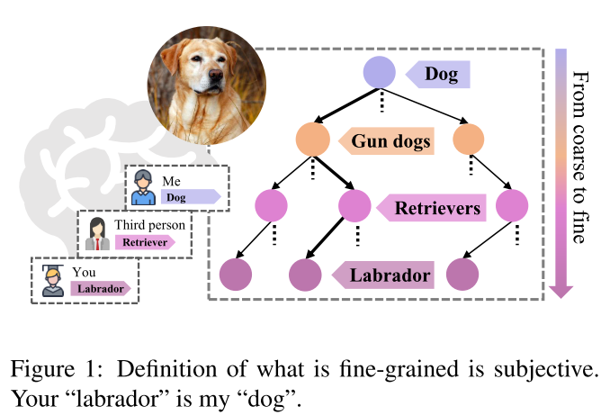

# Fine-Grained-or-Not
Code release for Your “Labrador” is My “Dog”: Fine-Grained, or Not (CVPR 2021 Oral)
[DOI](https://arxiv.org/abs/2011.09040 "arxiv")


<!--  -->


## Changelog
- 2021/03/05 upload the code.


## Requirements

- python 3.6
- PyTorch 1.2.0
- torchvision

## Data
- Download datasets
- Extract them to `data/cars/`, `data/birds/` and `data/airs/`, respectively.
- Split the dataset into train and test folder, the index of each class should follow the Birds.xls, Air.xls, and Cars.xls

* [CUB-200-2011](http://www.vision.caltech.edu/visipedia/CUB-200-2011.html) (birds)
```
  -/birds/train
	         └─── 001.Black_footed_Albatross
	                   └─── Black_Footed_Albatross_0001_796111.jpg
	                   └─── ...
	         └─── 002.Laysan_Albatross
	         └─── 003.Sooty_Albatross
	         └─── ...
   -/birds/test	
             └─── ...         
```
* [FGVC-Aircraft](http://www.robots.ox.ac.uk/~vgg/data/fgvc-aircraft/) (airs)
```
  -/air/train
	         └─── 001.A300B4
	         	       └─── 0056978.jpg
	                   └─── ...
	         └─── 002.A310
	         └─── 003.A318
	         └─── ...
   -/air/test	
             └─── ...   
```

* [Stanford-Cars](https://ai.stanford.edu/~jkrause/cars/car_dataset.html) (cars)
```
  -/cars/train
	         └─── 001.AM General Hummer SUV 2000
	         	       └─── 00163.jpg
	                   └─── ...
	         └─── 002.Acura RL Sedan 2012
	         └─── 003.Acura TL Sedan 2012
	         └─── ...
   -/cars/test	
             └─── ...   
```


## Training
- `python Birds_ours_resnet.py` or `python Air_ours_resnet.py` or `python Cars_ours_resnet.py`


## Citation
If you find this paper useful in your research, please consider citing:
```
@InProceedings{Chang2021Labrador,
  title={Your “Labrador” is My “Dog”: Fine-Grained, or Not},
  author={Chang, Dongliang and Pang, Kaiyue and Zheng, Yixiao and Ma, Zhanyu and Song, Yi-Zhe and Guo, Jun},
  booktitle = {Computer Vision and Pattern Recognition},
  year={2021}
}
```


## Contact
Thanks for your attention!
If you have any suggestion or question, you can leave a message here or contact us directly:
- changdongliang@bupt.edu.cn
- mazhanyu@bupt.edu.cn
